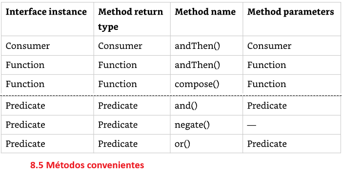

# Cap. 08 - Lambdas and Functional Interfaces

## Lambdas

La programación funcional es una forma de escribir código de forma más declarativa. Se especifica lo que se quiere hacer en lugar de lidiar con el estado de los objetos. Se centra más en las expresiones que en los bucles.

Una expresión lambda es como un método sin nombre que existe dentro de una clase anónima. Tiene parámetros y un cuerpo al igual que los métodos completos, pero no tiene un nombre.

Para mostrar la potencia de las lambdas, usaremos un ejemplo donde deseamos mostrar todos los animales de una lista según algunos criterios. Primero de forma normal:

```java
//  Comenzamos creando un registro con 3 campos.

public record Animal(String species, boolean canHop, boolean canSwim) {}

// Supongamos que tenemos una lista de animales y queremos procesar los datos en función de un atributo específico. 
// Por ejemplo los animales que pueden saltar. Para ese definimos una interfaz que generalice este concepto y admita una variedad de comprobaciones.

public interface CheckTrait {
    boolean test(Animal a);
}

// Lo primero que queremos comprobar es si el Animal puede saltar por lo que creamos una clase que implementa la interfaz

public class CheckIfHopper implements CheckTrait {
    public boolean test(Animal a) {
        return a.canHop();
    }
}

// La clase parece simple y lo es. esto es parte del problema que resuelven los lambdas.

import java.util.*;

public class TraditionalSearch {
    public static void main(String[] args) {

        // lista de animales
        var animals = new ArrayList<Animal>();
        animals.add(new Animal("fish", false, true));
        animals.add(new Animal("kangaroo", true, false));
        animals.add(new Animal("rabbit", true, false));
        animals.add(new Animal("turtle", false, true));
        
        // pass class that does check
        print(animals, new CheckIfHopper()); // (13)
    }

    private static void print(List<Animal> animals, CheckTrait checker) {
        for (Animal animal : animals) {
            // general check
            if(checker.test(animal)) {
                System.out.println(animal + "");
            }
            System.out.println();
        }
    }
}

```

¿Qué pasa si queremos imprimir los animales que nadan? Podriamos crear otra clase (CheckIfSwims). Si bien son solo unas pocas líneas, es carga. 

Después agregar la línea debajo de la línea 13. Todo esto se puede simplificar con lambdas. La línea 13 se puede cambiar por: 

`print(animals, a -> a.canHop());`

Esto le dice a Java que solo nos importa si una animal puede saltar.

Ahora si queremos los animales que pueden nadar sería agregar la línea:

`print(animals, a -> a.canSwim());`

Y si queremos los animales que no pueden nadar sería: 

`print(animals, a -> !a.canSwim());`

Las lambdas usan un concepto llamado ejecución diferida que significa que el código se especifica ahora, pero se ejecuta más tarde. 

En este caso "más tarde" está dentro del cuerpo del método `print()`, a diferencia de cuando se pasa al método de forma normal.

### Sintaxis de las Lambdas

La sintaxis mas basica de un lambda es:

`a -> a.canHop()`

Las lambdas funcionan con interfaces que tienen exactamente un método abstracto. En este caso, Java analiza la interfaz CheckTrait, que tiene un método. 

La lambda en nuestro ejemplo sugiere que Java debería llamar a un método con un parámetro Animal que devuelva un valor booleano que sea el resultado de `a.canHop()`

Java se basa en el contexto para determinar el significado de las expresiones lambda. Entendiendo contexto a donde y cómo se interpreta la lambda. 

Refiriéndonos a nuestro ejemplo anterior, pasamos la lambda como segundo parámetro del método `print()`:

`print(animals, a -> a.canHop());`

El método `print()` espera un objeto `CheckTrait` como segundo parámetro:

`private static void print(List<Animal> animals, CheckTrait checker) {}`

Como estamos pasando una lambda, Java intenta mapear nuestra lambda a la declaración del método abstracto en la interfaz CheckTrait:

`boolean test(Animal a);`

Dado que el método de esa interfaz toma un Animal, el parámetro lambada tiene que ser un Animal. Y como el método de esa interfaz devuelve un booleano, sabemos que la lambda devuelve un booleano.

La sintaxis de las lambdas son complicadas porque tiene valores opciones, por ejemplo las siguientes expresiones son iguales:

`a -> a.canHop()`

`(Animal a) -> { return a.canHop(); }`

Los parentesis alrededor de los parámetros lambda se puede omitir solo si hay un solo parámetro y su tipo no se indica explicitamente.

Se puede omitir una sentencia `return` y un `;` cuando no se utilizan llaves, pero esto no aplica cuando se tiene dos o más declaraciones. 

Las siguientes sentencias también son posibles: 

`a -> {return a.canHop();}`

`(Animal a) -> a.canHop()`

La primera fila toma cero parámetros y siempre devuelve el valor booleano verdadero. 

La segunda fila toma un parámetro y llama a un método sobre él, devolviendo el resultado. 

La tercera fila hace lo mismo, excepto que define explicitamente el tipo de la variable. 

Las dos últimas filas toman 2 parámetros e ignoran uno de ellos.

| Lambda                                         | # de parametros |
|------------------------------------------------|-----------------|
| `() -> true`                                   | 0               |
| `x -> x.startsWith("test")`                    | 1               |
| `(String x) -> x.startsWith("test")`           | 1               |
| `(x,y) -> {return x.startsWith("test");}`      | 2               |
| `(String x, String y) -> x.startsWith("test")` | 2               |

### Codificando interfaces funcionales

En las secciones anteriores declaramos la interfaz CheckTrait, que tiene un método que debe ser implementado. 

Las lambdas tienen una relación con dichas interfaces. Una interfaz funcional es una interfaz que contiene un solo método abstracto. 

Se le denomina **single abstract method** (SAM). 

```java
// En este ejemplo la interfaz Sprint es de tipo funcional (me aseguro al definir la anotación) porque solo tiene un método abstracto
@FunctionalInterface
public interface Sprint {
    public void sprint(int speed);
}

public class Tiger implements Sprint{
    public void sprint(int speed){
        System.out.println("Animals is sprinting fast!" + speed);
    }
}
```

La anotación `@FunctionalInterface` le dice al compilador que el codigo es para una interfaz funcional y se validara para que esté alineado con estas reglas.

Pero tener en cuenta que lo que hace a una interfaz funcional no es la anotación, sino el solo tener un método abstracto definido. 

Todas las clases heredan ciertos métodos de Object los cuales son:

* `public String toString()`
* `public boolean equals(Object)`
* `public int hashCode()`

Esto se menciona porque existe una excepción a la regla del método abstracto. 

Si una interfaz funcional incluye un método abstracto con la misma firma que un método público que se encuentra en `Object`, esos métodos no cuentan para la prueba del método abstracto único. 

Esto porque cualquier clase que implemente la interfaz heredara de `Object` esos métodos.

```java
// No es una interfaz funcional  ya que toString() es un método público de Object por lo que no cuenta para la prueba de método abstracto único.

public interface Soar {
    abstract String toString();
}

// Dive si es una interfaz funcional.
// Dive si es una interfaz funcional ya que el método dive() es el único método abstracto, mientras que los demas no se cuentan ya que son métodos públicos definidos en la clase Object. 

public interface Dive {
    String toString();
    public boolean equals(Object o);
    public abstract int hashCode();
    pubic void dive();
}

// Esta interfaz arroja un error ya que 'equals' no recibe un tipo 'Object' sino 'Hibernate' por lo que se convierte en un método abstracto y junto a 'void' ya serían 2.
// Por lo que esta no podría ser una interfaz funcial
public interface Hibernate {
    String toString();
    public boolean equals(Hibernate o);
    public abstract int hashCode();
    public void rest();
}
```
## Usando referencia de métodos

La referencia a métodos es otra forma de hacer más facil la lectura de código al solo mencionar el nombre del método.

Supongamos que estamos codificando un patito que intenta aprender a graznar. Primero tenemos una interfaz funcional:

```java
public interface LearnToSpeak {
    void speak(String sound);
}
```
A continuación, descubrimos que hay una clase auxiliar con la que el patito puede trabajar la cual se define de la siguiente forma

```java
public class DuckHelper {
    public static void teacher(String name, LearnToSpeak trainer){
        trainer.speak(name);
    }
}
```

Finalmente, juntamos todo y conocemos la implementación de la interfaz funcional usando lambda

```java
public class Duckling {
    public static void makeSound(String sound){
        LearnToSpeak learner = s -> System.out.println(s);
        DuckHelper.teacher(sound,learner);
    }
}
```

Está bien la implementación, pero tiene una redundancia. La lambda declara un parámetro llamado `s`. 

Sin embargo, ese parámetro solo se pasa a otro método. 

Una referencia a un método nos permite eliminar esa redundancia, y en su lugar, escribir esto: 

```java
LearnToSpeak learner = System.out::println;
```

El operador `::` le indica a Java que llame al método println() más tarde. Este operador crea una referencia al método `println`, para eso: 

1. Reconoce que `LearnToSpeak.speak()` recibe un `String`
2. Ve que `System.out.println()` también puede recibir un `String`
3. Conecta ambos directamente sin necesidad de declarar parámetros intermedios

**Explicación mas resumida**

```java
// 1. La interfaz funcional
public interface LearnToSpeak {
    void speak(String sound);
}

// 2. El helper que usa la estrategia
public class DuckHelper {
    public static void teacher(String name, LearnToSpeak trainer){
        trainer.speak(name);
    }
}

// 3. Duckling que junta todo
public class Duckling {
    public static void makeSound(String sound){
        // Aquí defines CÓMO quieres que hable el patito
        LearnToSpeak learner = System.out::println;

        // Y se lo pasas al helper para que lo ejecute
        DuckHelper.teacher(sound, learner);
    }
}

// 4. Uso final
public class Main {
    public static void main(String[] args) {
        Duckling.makeSound("Quack!");  // Imprime: Quack!
    }
}
```

Una **referencia a un método** y **una lambda** se comportan de la misma manera en tiempo de ejecución. 

Puedes imaginar que el compilador convierte tus referencias a métodos en lambdas por ti. 

Hay cuatro formas para las referencias a métodos:

### Llamando a métodos estaticos

```java
interface Converter{
    long round(double num);
}
```

La interfaz anterior podemos implementarla con el método `round()` en Math. Aquí asignamos una referencia a un método y una lambda a esta interfaz funcional:

```java
Converter methodRef = Math::round;
Converter lambda = x -> Math.round(x);

System.out.println(methodRef.round(100.1)); // 100
```

La primera linea usando referencia a un método con un parámetro, Java pasara el parámetro a ese método.

La segunda línea usa un método lambda con un parámetro que al final se pasa a la función.

Para este ejemplo el método `round()` está sobrecargado por la definición de interfaz ¿Cómo Java sabe si usar la versión con double o float como parámetro?

Esto lo hace por la información del contexto. Java busca un método que coincida con lo implementado. Si no encuentro o hay varias coincidencias, se arroja un error de tipo ambiguo.

### Llamando a métodos de instancia en un objeto específico

```java
interface StringStart{
    boolean beginningCheck(String prefix);
}
```

Ahora usaremos el método `startsWith()` de la clase String que toma un parámetro y devuelve un booleano.

```java
var str = "Zoo";
StringStart methodRef = str::startsWith;
StringStart lambda = s -> str.startsWith(s);

System.out.println(methodRef.beginningCheck("A")); // false
```
La segunda línea muestra que queremos llamar a  `str:startsWith()` y pasar un parametro en tiempo de ejecución 

En el siguiente ejemplo, creamos una interfaz funcional con un método que no acepta ningún parámetro, pero devuelve un valor.

```java
interface StringChecker{
    boolean check();
}
```

Lo implementamos de la siguiente forma

```java
var str = "";
StringChecker methodRef = str::isEmpty;
StringStart lambda = () -> str.isEmpty();

System.out.println(methodRef.check()); // true
```

Dado que el método en String es un método de instancia, llamamos a la referencia, al método en una instancia de la clase String. 

Si bien todas las **referencias a métodos** se pueden **convertir a lambdas**, lo contrario no siempre se cumple. 

### Llamando a métodos de instancia en un parámetro

```java
interface StringParameterChecker{
    boolean check(String text);
}
```

Implementamos la funcionalidad de la siguiente manera

```java
StringParameterChecker methodRef = str::isEmpty;
StringParameterChecker lambda = s -> s.isEmpty();

System.out.println(methodRef.check("Zoo")); // false
```

La primera línea indica que el método que queremos llamar está en `String`, parece un método estático, pero no lo es.

En cambio, Java sabe que isEmpty() es un método de instancia que no toma ningún parámetro. 

Java utiliza el parámetro proporcionado en tiempo de ejecución como la instancia en la que se llama al método. 

```java
interface StringTwoParameterChecker{
    boolean check(String text, String prefix);
}
```

Implementamos la funcionalidad de la siguiente manera

```java
StringTwoParameterChecker methodRef = str::startsWith;
StringTwoParameterChecker lambda = (s,p) -> s.startsWith(p);

System.out.println(methodRef.check("Zoo","A")); // false
```

Dado que la interfaz funcional toma dos parámetros, Java tiene que determinar qué representan. 

El primero siempre será la instancia del objeto para los métodos de instancia. Los demás seran parámetros del método.

### Llamando a constructores

Una referencia a un constructor es un tipo especial de referencia a un método que usa `new` en lugar de un método de instancia de un objeto.

```java
interface EmptyStringCreator{
    String create();
}
```

Para llamarla, usamos `new` como si fuera un nombre de método: 

```java
EmptyStringCreator methodRef = String::new;
EmptyStringCreator lambda = () -> new String();

var myString = methodRef.create();
System.out.println(myString.equals("Snake")); //false
```

Se expande como las referencias a métodos que se han visto hasta ahora. 

```java
interface StringCopier{
    String copy(String value);
}
```

```java
StringCopier methodRef = String::new;
StringCopier lambda = x -> new String(x);

var myString = methodRef.copy("Zebra");
System.out.println(myString.equals("Zebra")); //true
```

En la implementación la primera línea de este ejemplo es igual al ejemplo anterior, 
lo que indica que no siempre se puede determinar que método se puede llamar mirado la referencia del método.

Hay que mirar el contexto para ver qué parámetros se utilizan y si hay un tipo de retorno. 

### Trabajando con interfaces funcionales integradas

Las siguientes interfaces se encuentra definidas en el paquete `java.util.function`. Se veran los genericos en el siguiente capítulo,
pero se debe saber que `<T>` permite que la interfaz tome un objeto de un tipo específico. 

Si se necesita un segundo parámetro, usamos la siguiente letra U, si se necesita un tipo de retorno distinto, elegimos R para el retorno con tipo genérico.

| Functional interface | Return type | Method name | # of parameters |
|----------------------|-------------|-------------|-----------------|
| Supplier<T>          | T           | get()       | 0               |
| Consumer<T>          | void        | accept(T)   | 1 (T)           |
| BiConsumer<T, U>     | void        | accept(T,U) | 2 (T, U)        |
| Predicate<T>         | boolean     | test(T)     | 1 (T)           |
| BiPredicate<T, U>    | boolean     | test(T,U)   | 2 (T, U)        |
| Function<T, R>       | R           | apply(T)    | 1 (T)           |
| BiFunction<T, U, R>  | R           | apply(T,U)  | 2 (T, U)        |
| UnaryOperator<T>     | T           | apply(T)    | 1 (T)           |
| BinaryOperator<T>    | T           | apply(T,T)  | 2 (T, T)        |

#### Implementación de Supplier

Un Supplier se utiliza cuando se desea generar valores sin tomar ninguna entrada. 

```java
@FunctionalInterface
public interface Supplier<T>{
    T get();
}
```

Puede crear un objeto LocalDate utilizando el método de fábrica `now()`

```java
Supplier<LocalDate> s1 = LocalDate::now;
Supplier<LocalDate> s2 = () -> LocalDate.now();

LocalDate d1 =  s1.get();
LocalDate d2 =  s2.get();

System.out.println(d1); //2022-02-20
System.out.println(d2); //2022-02-20
```

Este ejemplo imprime una fecha 2 veces, una utilizando la referencia de métodos y la segunda usando una lambda. 

Un Supplier se utiliza a menudo para construir objetos nuevos, como en el siguiente ejemplo: 

```java
Supplier<StringBuilder> s1 = StringBuilder::new;
Supplier<StringBuilder> s2 = () -> new StringBuilder();

System.out.println(s1.get()); // Cadena vacia
System.out.println(s2.get()); // Cadena vacia
```

El siguiente ejemplo muestra la versatilidad en la cual utilizamos un generico dentro de otro generico 

```java
Supplier<ArrayList<String>> s3 = ArrayList::new;
ArrayList<String> a1 = s3.get();
System.out.println(a1); // []
```

#### Implementación de Consumer y BiConsumer

Se usa Consumer cuando se quiere hacer algo con un parámetro, pero no devolver nada.

BiConsumer hace lo mismo, excepto que toma 2 parámetros. Las interfaces se definen de la siguiente manera:

```java
@FunctionalInterface
public interface Consumer<T>{
    void accept(T t)
}

@FunctionalInterface
public interface BiConsumer<T,U>{
    void accept(T t, U u)
}

Consumer<String> c1 = System.out::println;
Consumer<String> c2 = x -> System.out.println(x);

c1.accept("Annie"); //Annie
c2.accept("Annie"); //Annie

// BiConsumer 
var map = new HashMap<String, Integer>();
BiConsumer<String, Integer> b1 = map::put;
BiConsumer<String, Integer> b2 = (k,v) -> map.put(k,v);

b1.accept("chicken", 7);
b2.accept("chick", 1);

System.out.println(map); //{chicken=7,chick=1); 
```
En el ejemplo anterior durante la llamada de b1 se usan una referencia por método de instancia a un objeto, ya que queremos 
llamar a un método en la variable local map. 

#### Implementación de Predicate y BiPredicate

Predicate se usa a menudo al filtrar o comparar. Ambas operaciones son parecidas solo que la segunda acepta dos parametros. 

```java
@FunctionalInterface
public interface Predicate<T>{
    boolean test(T t);
}

@FunctionalInterface
public interface BiPredicate<T,U>{
    boolean test(T t, U u);
}

Predicate<String> p1 = String::isEmpty;
Predicate<String> p2 = x -> x.isEmpty();

System.out.println(p1.test("")); //true
System.out.println(p2.test("")); //true 

BiPredicate<String> b1 = String::startsWith;
BiPredicate<String> b2 = (string, prefix)-> string.startsWith(prefix);

System.out.println(b1.test("chicken", "chick")); //true
System.out.println(b2.test("chicken", "chick")); //true
```

En el ejemplo anterior se puede ver como el uso de la referencia de método ahorra escritura pero se debe saber lo que se hace.  

#### Implementación de Functions y BiFunctions

Un Function es responsable de convertir un parámetro en un valor de un tipo diferente y devolverlo. 

De la misma forma un BiFunction es  responsable de convertir dos parámetros en un valor y devolverlo.

```java
@FunctionalInterface
public interface Function<T,R>{
    R apply(T t);
}

@FunctionalInterface
@public interface BiFunction<T,U,R>{
    R apply(T t, U u);
}

Function<String, Integer> f1 = String::length;
Function<String, Integer> f2 = x -> x.length();

System.out.println(f1.apply("cluck")); //5
System.out.println(f2.apply("cluck")); //5

BiFunction<String, String, String> b1 = String::concat;
BiFunction<String, String, String> b2 = (string, toAdd) -> string.concat(toAdd);

System.out.println(b1.apply("baby","chick")); //baby chick
System.out.println(b1.apply("baby","chick")); //baby chick
```

En el primer ejemplo convierte una cadena a un entero, el segundo combina 2 cadenas para formar una nueva. 

Los 2 primeros tipos en BiFunction son los tipos de entrada, el tercero es el tipo de la salida.

#### Implementación de UnaryOperator y BinaryOperator

UnaryOperator y BinaryOperator son casos especiales de function, ya que requieren que todos los parámetros de tipo sean del mismo tipo. 

Un UnaryOperator transforma su valor en uno del mismo tipo. Por ejemplo, incrementar en 1 es una operación unaria.

Un BinaryOperator fusiona dos valores en uno del mismo tipo. Sumar dos números es una operación binaria. 

```java
@FunctionalInterface
public interface UnaryOperator<T> extends Function<T,T>{
    //
}

@FunctionalInterface
@public interface BinaryOperator<T> extends BiFunction<T,T,T>{
    //
}

UnaryOperator<String> u1 = String::toUpperCase;
UnaryOperator<String> u2 = x -> x.toUpperCase();

System.out.println(u1.apply("chirp")); // CHIRP
System.out.println(u2.apply("chirp")); // CHIRP

BinaryOperator<String> b1 = String::concat;
BinaryOperator<String> b2 = (string,toAdd) -> string.concat(toAdd);

System.out.println(b1.apply("baby","chick")); // baby chick
System.out.println(b2.apply("baby","chick")); // baby chick
```

En el ejemplo de UnaryOperator no necesitamos definir el retorno porque requiere que sea dle mismo tipo de entrada.

En el ejemplo de BinaryOperator es más conciso que BiFunction, ya que el parámetro definido es suficiente porque todos son del mismo tipo.

#### Usando metodos convenientes en interfaces funcionales 

Por definicion todas las interfaces funcionales tienen un único método abstracto. Sin embargo, esto no significa que solo pueden tener un método.

Varias de las interfaces funcionales comunes proporcionan una serie de métodos de interfaz predeterminados útiles.



La tabla muestra los métodos convenientes en las interfaces funcionales principales, BiConsumer, BiFunction y BiPredicate tienen similares métodos. 

